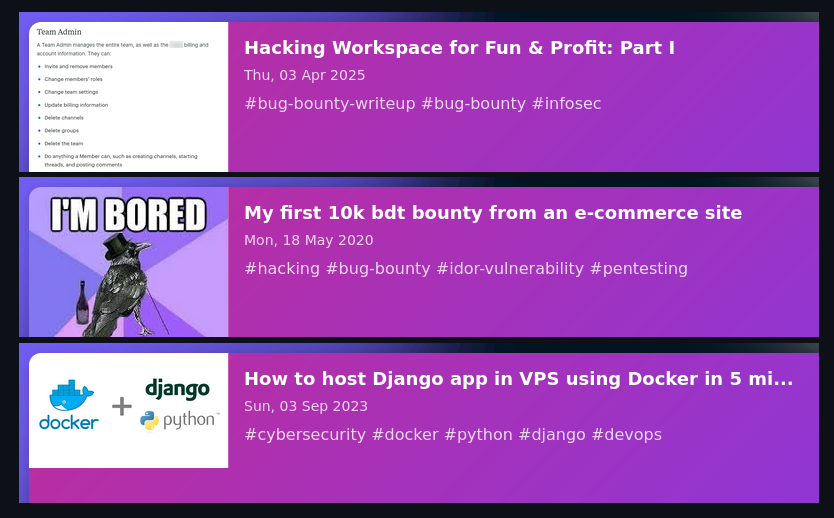

<div align="center">



# Readme Medium Card


Generate stylish SVG cards for your **Medium** articles to showcase in your **GitHub** README, featuring title, publish date, and categories.

</div>

## Overview

Readme Medium Card is a Flask-based tool that fetches your **Medium** articles via RSS and creates visually appealing SVG cards. Each card displays a thumbnail, title, publication date and categories (e.g., `#tech #ai`).

## Usage

```markdown

```